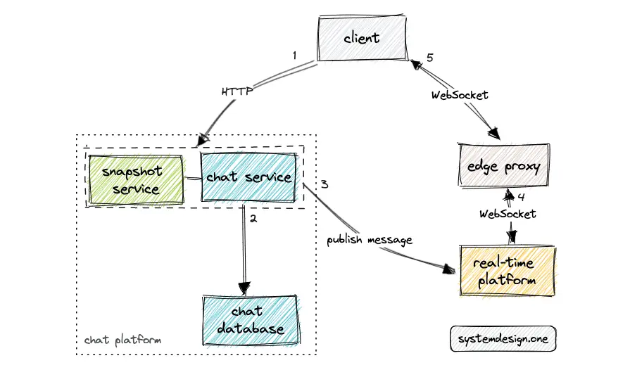

# To_read
Interesting documents to read/watch with a brief explanation about it
- [Slack Architecture](https://systemdesign.one/slack-architecture)
Explain key concepts about chat architecture 

- [Angular Architecture Patterns and Best Practices (that help to scale)](https://dev-academy.com/angular-architecture-best-practices/)
- Holly bible about nestJS with several other tools https://wanago.io/2023/06/12/api-nestjs-prisma-serializing/
- To have a library to handle store as VueJs does https://ngrx.io/guide/store

- [Stop using “npm install” in your CI/CD pipeline](https://medium.com/@robert.maiersilldorff/stop-using-npm-install-in-your-ci-cd-pipeline-ba0378bbebfb)